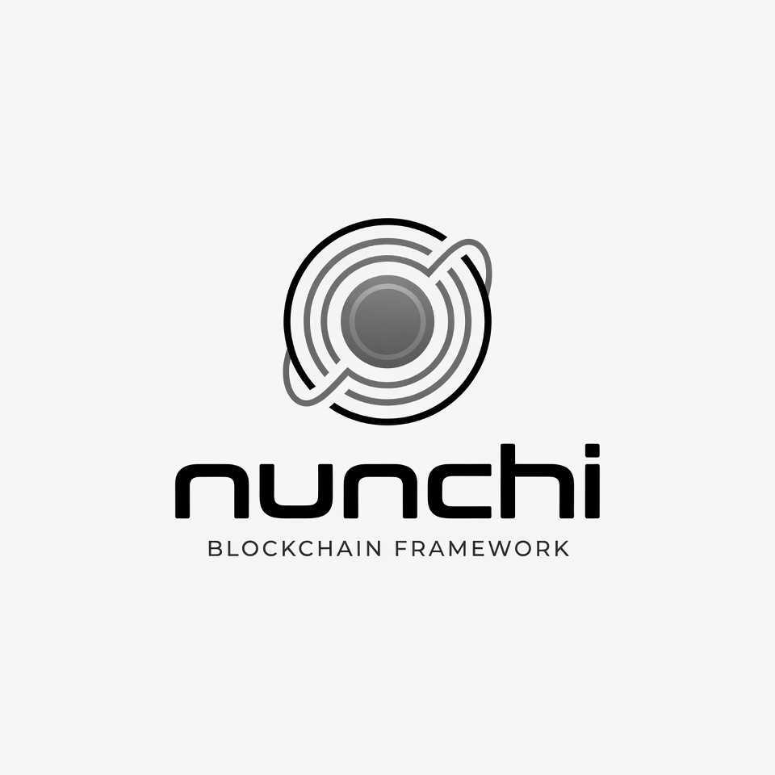

  

<h3 align="center">Nunchi SDK</h3>

  modular blockchain framework adding financial primitives to commonware-based chains

  <a href="https://docs.nunchi.trade"><strong>Docs</strong></a> &nbsp;&bull;&nbsp;
  <a href="https://discord.gg/nunchi"><strong>Discord</strong></a> &nbsp;&bull;&nbsp;
  <a href="https://x.com/nunchi"><strong>X</strong></a>

  

---

# What this is
The Nunchi SDK is an easy-to-use modular blockchain framework offering financial primitives for commonware-based chains. The core of the framework can be found in the [`nunchi-coins`](coins/) crate

A chain built with the Nunchi SDK adopts our coin and account model, dkg resharing, and bridging setup. The SDK is handcrafted for the requirements of specialized low-latency finance.

## Modules

This repository will contain modules for building public and private blockchains, as well as sequencer systems / rollups. 

### Blockchain Basics

* [`nunchi-coins`](coins/) - defines what a coin and account are
* [`nunchi-common`](common/) - core abstractions for addresses, state db, and runtime
* [`nunchi-crypto`](crypto/) - core primitives/wrappers around commonware cryptographic primitives
* [`nunchi-rpc`](rpc/) - core abstractions for modular RPC
* [`nunchi-dkg`](dkg/) - contains dkg resharing ceremony logic and a consensus engine orchestator
* [`nunchi-bridge`](bridge/) - bridges state roots from other chains, to verify against
* [`nunchi-mempool`](mempool/) - simple p2p mempool
* [`nunchi-oracle`](oracle/) - ingests namespaced, arbitrary data for interpretation by other modules 
* `nunchi-chat` - allows humans or agents to publish to permanent on-chain public conversations
* `nunchi-factory` - wrapper of coins for mass issuance 

### Network Infrastructure 

* [`nunchi-authority`](authority/) - provides a proof of authority setup for a chain
* `nunchi-pos` - provides a proof of stake security setup for a chain

* [`nunchi-narae`](narae/) - local devnet runner
* [`nunchi-chain`](chain/) - runtime primitives for generated nunchi chains.

### Financial Primitives

* `nunchi-margin` - user has BTC + nunchi and doesn't want to sell, and deposits BTC+nunchi and gets a stablecoin.  Could be backed by other coins, not just btc and nunchi. 
* `nunchi-securities` - Non-synthetic perps contracts (delivery of tokenized stock)
* `nunchi-vaults` - a module for running vaults composed of many types of capital, traded by an authorised offchain party
* [`nunchi-clob`](clob/) - used on the global chain, provides liquidity between local chain tokens
* `nunchi-derivatives` - ingests a price feed and creates derivatives products
* `nunchi-stablecoin` - a wrapper of coins special for the needs of stablecoins

### Chain Examples

* [`coins-chain`](examples/coins/chain) - default PoA chain
* [`bridge-chain`](examples/bridge-chain) - two chains bridging consensus certificates
* [`custom-module`](examples/custom-module) - starter template for creating a custom nunchi module

## Commonware compatibility

This workspace pins `commonware-*` crates to **2026.7.0**.

When upgrading nodes:

* Do not run mixed commonware versions in the same peer set (marshal coding / ZODA shards and other wire formats are not interchangeable).
* Mid-sync glue metadata from v2026.5.0 cannot resume after upgrading to v2026.7.0; clear or re-sync any node that crashed mid state-sync before the bump.
* Fresh joining nodes can enable peer QMDB state sync with `state_sync = true`. Nunchi's resolver preserves Commonware's standard wire layout while decoding variable-value operations with the chain-wide 512 KiB value bound.
