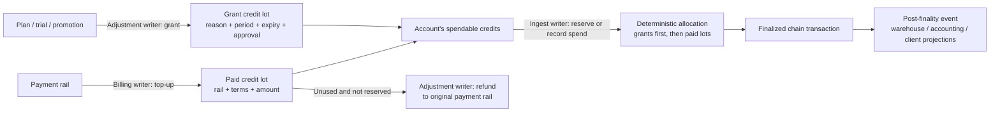

# nunchi-costs

`nunchi-costs` is an account-scoped custodial credit-accounting primitive for
Nunchi chains. It has no dependency on any product UI, billing provider,
event schema, data warehouse, accounting system, or client wallet.

The module owns only opaque `account_id` account state:

- active/suspended accounts, available credit, and reserved credit;
- backend writer capabilities (`Admin`, `Ingest`, `Billing`, `Adjustment`);
- idempotent top-ups, grants, reversals, normalized spend, and reservations;
- a registry for untracked/shared sources that has no automatic debit path;
- staged, atomic effective-at rate-card changes with global and exact-account
  precedence; and
- finality-outbox envelopes derived after a transaction is finalized.

All chain writes require an allowlisted backend signer. Client applications and
end users never receive a chain key or submit a raw transaction.

## Why grants and paid credits are separate

They are the same unit of spend, but they are not the same economic claim.
The ledger therefore represents each ingress as a distinct **credit lot** rather
than keeping only one aggregate balance:

- A **paid credit lot** comes from a payment rail. It retains its `rail_ref`,
  purchase amount, terms version, and any bonus credits. Unused paid credit can
  be refunded only to that originating rail.
- A **grant credit lot** comes from a plan entitlement, trial, promotion, or
  goodwill decision. It retains its reason, period, approval, audit reference,
  and expiry. It is non-refundable.

This distinction is necessary even though both lots are denominated in
credits. A single undifferentiated balance could not answer whether a refund is
permitted, which credits expire, or why a particular amount was issued and
consumed. It would also allow promotional value to be accidentally returned as
cash-equivalent value. The account read model exposes paid and grant balances
separately while the spending interface treats both as one spendable pool.

### Stored-value flow



For a spend or reservation, the ledger first selects unexpired grants (earliest
expiry first) and then paid lots. The exact allocations are stored with the
spend or reservation. That makes the result deterministic and preserves the
remaining refundable paid balance. A reservation keeps the selected lots on
hold; it may settle into a spend or be released/expired, after which the same
lots become available again.

The authorization boundary mirrors these economic responsibilities: `Billing`
can create paid top-ups, `Adjustment` can issue grants and process refunds, and
`Ingest` can reserve or record product usage. Each command and post-finality
event is idempotent, so retries cannot mint or spend a lot twice.

## Local proof

```sh
cargo test -p nunchi-costs
```

The test suite validates rate activation, payment-rail top-ups, reservation and
settlement, duplicate-event suppression, post-finality journal facts, stored
value provenance, refunds, and untracked-cost zero-debit behavior.

## Deliberate boundaries

This module is not a billing-provider integration. External event decoding,
pricing-policy approval, user interfaces, credentials, and production adapters
remain outside the ledger. Applications must preserve the module's idempotency,
authorization, provenance, and finality semantics.
