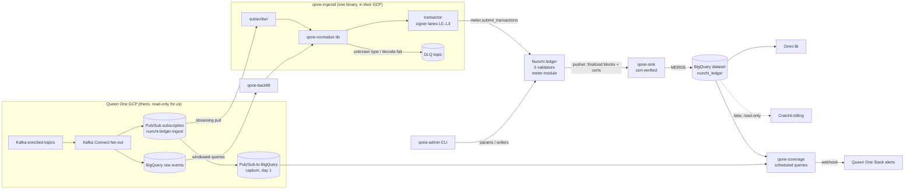

# Queen One → Nunchi Ledger: V1 Module Map

**Status:** design for build (no code in this PR). The team builds against this document.
**Scope:** ingest Queen One's Pub/Sub event stream into the Nunchi ledger and produce token-denominated cost accounting per task / product / site, with read paths for their Omni BI and (later) Cratchit billing.
**Dates:** discovery sign-off Jul 17 · integrated in staging Aug 21 · production Sep 4 · live Sep 7 (Labor Day).
**Naming discipline:** in anything a Queen One person might see — dashboards, alert text, shared docs, GCP resource names — say **"ledger"** or **"Event Sphere"**. Never "blockchain", and avoid "chain" (per the CTO close-package rules of the room). This document cites internal crate and file names verbatim; do not paste those sections into client-facing artifacts.

Grounding: all file/line cites are against `nunchi-labs/sdk` @ `3ab5573` (2026-07-10), `nunchi-labs/knight` @ HEAD, `Nunchi-trade/queen` @ HEAD, `nunchi-labs/devnet` @ HEAD, and the sdk `devnet` branch (indexer code). Numbers are either a cited constant or an explicitly stated assumption.

---

## 1. What the SDK has today

### 1.1 Module system

There is **no `Module` trait** (verified: zero occurrences). A module is a convention with four parts, and the chain composes modules at compile time:

1. An `Operation` enum implementing `nunchi_common::Operation` with a domain-separating `NAMESPACE` ([common/src/transaction.rs](../../common/src/transaction.rs)); its tx type is `nunchi_common::Transaction<Op>` (signed, nonce-carrying).
2. A typed DB trait **blanket-implemented over any `StateStore`** (e.g. `impl<S: StateStore> CoinDB for S`, [coins/src/db.rs](../../coins/src/db.rs)) — this is how modules share one physical store without coupling.
3. A `Ledger<D>` state machine exposing `apply_transaction` (signature verify → nonce check → operation dispatch), e.g. [coins/src/ledger.rs](../../coins/src/ledger.rs).
4. Optional `rpc.rs` registering jsonrpsee method fragments into the chain's `RpcRouter` ([rpc/src/lib.rs](../../rpc/src/lib.rs)).

A chain then defines a top-level transaction enum (hand-written or via `transaction_wrapper!`, [chain/src/macros.rs](../../chain/src/macros.rs)) and implements `Runtime::{validate, apply}` ([common/src/runtime.rs:29](../../common/src/runtime.rs)) to route each variant to its module ledger. Working exemplars, most relevant first:

| Exemplar | Where | Why it matters here |
|---|---|---|
| queen `spend-module` | `Nunchi-trade/queen` `crates/spend-module/src/{types,transaction,db,ledger,rpc}.rs` | A third-party spend-event module: typed binary events, `RecordSpendBatch` (≤100), sequential u64 log. The chassis `meter-module` extends. |
| Knight | `nunchi-labs/knight` `src/knight_module/`, `src/runtime.rs` | Accounting semantics (categories, usage×unit-cost reconciliation, token catalog) + the two-module `Runtime` composition pattern we will copy. |
| `examples/custom-module` | [examples/custom-module](../../examples/custom-module) | The maintained starter skeleton (compiled in-workspace so drift is caught). |

### 1.2 State

One authenticated QMDB per node ([common/src/state_db.rs](../../common/src/state_db.rs)): namespaced keys `SHA256(tag ‖ table ‖ logical)`, merkleized root committed per block, `Overlay` for atomic cross-module writes, `QmdbReader` snapshots for queries. State inclusion proofs exist and are sound for append-only records (`verify_state_update`), which fits an append-only spend ledger exactly. The operation log is append-only; historical proofs are supported (#116/#124).

### 1.3 How external data reaches the ledger — the confirmed idiom

**External data enters only as signed transactions submitted over JSON-RPC by off-chain transactors.** The node binary never polls an external API. Verified across every feeder in the ecosystem: the Knight CLI (`knight/src/main.rs` signs oracle appends), queen-sim (`queen/crates/queen-sim` signs spend batches), the MCP server ([mcp/src/server.rs](../../mcp/src/server.rs) builds/signs off-node and forwards), and the bridge relayer (`examples/bridge-chain/src/bin/bridge-relayer.rs`). This design keeps that idiom: everything between Pub/Sub and the ledger is an off-chain transactor.

### 1.4 Oracle module — evaluated and not used for this volume

[oracle/](../../oracle) stores opaque, namespaced, interval-bucketed payloads via a single `AppendRecord` op. It is the right primitive for low-rate feeds, and the wrong one here, for three code-level reasons:

- `MAX_RECORDS_PER_BUCKET = 1024` per (namespace, interval) ([oracle/src/types.rs:10](../../oracle/src/types.rs)) — 11M events/day would need thousands of interval buckets per day of ceremony; Knight's month-bucket usage overflows at 1,024 records.
- It deliberately never decodes payloads (`oracle/src/ledger.rs` module docs) — no typed fields means no on-ledger dedupe key, no cost computation, no rollups.
- `RecordId = SHA256(writer ‖ nonce ‖ namespace ‖ interval)` is **nonce-derived, not content-derived** — an at-least-once feeder that retries under a fresh nonce double-counts by construction.

This also settles the "normalize in-oracle" question that was considered and disliked: the oracle's own contract refuses interpretation, and the code is right to. See D1.

### 1.5 Mempool, blocks, RPC — the numbers the design is sized against

| Constant | Value | Source |
|---|---|---|
| Max tx size | 64 KiB | [mempool/src/config.rs:26](../../mempool/src/config.rs) |
| Pending per lane (lane = module namespace × account) | 256 | [mempool/src/config.rs:25](../../mempool/src/config.rs) |
| Mempool total / TTL | 1M txs / 25k blocks | [mempool/src/config.rs:24,27](../../mempool/src/config.rs) |
| Block tx cap | 4,096 | [chain/src/block.rs:18](../../chain/src/block.rs) |
| p2p max message size (block bound) | 1 MiB | `devnet/validators/validator-0.toml` (`max_message_size = 1048576`) |
| Consensus timeouts | leader 1,000 ms / certification 2,000 ms | `devnet/validators/validator-0.toml` |
| Batch submit ingress | `submit_transactions` → `MempoolHandle::submit_many` | [coins/src/rpc/mempool.rs:71](../../coins/src/rpc/mempool.rs) — exists, unused by the PoCs |

Other properties that shape the design: strict sequential nonces per lane with digest-level dedupe and same-nonce-replace semantics ([mempool/src/pool.rs](../../mempool/src/pool.rs)); transaction status is **in-memory only** and lost on node restart, so submission durability must live client-side; signature verification fans out over a Rayon pool ([chain/src/application.rs](../../chain/src/application.rs)); there is **no compute metering ("gas")** — fees are an optional flat base + per-byte config ([coins/src/fees.rs](../../coins/src/fees.rs), #121) that the devnet does not set — so the RPC port must never be publicly reachable; the state-sync resolver is stubbed ([chain/src/engine.rs](../../chain/src/engine.rs) `NoStateSyncResolver`), meaning node recovery replays archived blocks — which forbids pruning in V1 (§4).

### 1.6 Existing event/indexer code

On `main`, modules emit `Event{name, value}` to an `EventSink` and the chain indexes them per finalization ([chain/src/events.rs](../../chain/src/events.rs)) — but only no-op/in-memory consumers ship. The **sdk `devnet` branch** carries the real pattern: a validator-side pusher + durable backfiller (`examples/coins/chain/src/indexer/{pusher,backfiller}`) uploading finalized blocks to an off-node indexer server (`examples/coins/indexer`) that **verifies BLS threshold certificates before accepting anything**. Note what it is: a consensus-artifact store (routes `/seed`, `/notarization`, `/finalization`, `/block/{q}`), not a domain indexer — it decodes no application data and keeps state in in-memory BTreeMaps. We reuse its transport and certificate verification, not its store (component 4).

### 1.7 Knight — the accounting core we inherit semantics from

Knight ingests spend records (provider, category, usage_quantity, usage_unit, unit_cost_usd_micros, provider_invoice_id, billing_period, attributable_revenue) and computes on-ledger analysis snapshots: grouping by category/campaign, reconciliation `expected = quantity × unit_cost` with variance vs invoiced, contribution margin. Its "token catalog" (`build_token_catalog`) mints **categorical** tokens (IMGSPEND/TXTSPEND/VIDSPEND as `nunchi_coins` CoinSpecs) — it is a naming scheme, not unit conversion. The cost→token **conversion** arithmetic in this design is net-new (D4).

### 1.8 Expected but not found — flag list

- No Pub/Sub, Kafka, or BigQuery client code anywhere (all ingest glue is net-new).
- No content-level dedupe in any module (nonce-only replay protection) — closed by D3.
- No schema registry / versioning machinery — closed by the normalizer + versioned params design.
- No retries/backpressure/DLQ in any existing feeder (queen-sim aborts on first error).
- No measured throughput anywhere in the five repos; the "25k TPS @ 300 ms" figure quoted in the CTO close package is unvalidated sales arithmetic (§4.2).
- Multi-node production posture missing: the internal devnet runs **4** validators (target is ≥5 per Jacob's ruling), with validator private keys and DKG shares committed to the devnet repo in plaintext — that material is burned and must not be carried forward (§5).
- README-listed financial modules mostly not in-tree yet; `clob` landed 2026-07-10 (#117) as a full module; `margin`/`securities`/`vaults`/`derivatives`/`stablecoin`/`pos`/`chat`/`factory` remain absent.

---

## 2. V1 component map

Seven components. Three are on the critical ingest path and live in **one deployable binary** (`qone-ingestd`); one is on-ledger; three are read/ops-side.

### 2.1 `qone-ingestd` — subscriber + normalizer + transactor (off-chain, one binary)

One Rust binary on a single GCE VM (or Cloud Run with `max-instances=1` — the transactor needs single-writer identity per lane), expected to run **in Queen One's GCP project** (their CTO's stated preference). Three internal stages:

**Subscriber.**
- *Responsibility:* streaming pull from the dedicated subscription; flow control; ack discipline. It owns the at-least-once boundary with their infrastructure.
- *In:* `projects/<their-project>/subscriptions/nunchi-ledger-ingest` (protobuf CloudEvents), authenticated as the Ian-provisioned service account via workload identity.
- *Out:* decoded records to the transactor; undecodable/unknown messages to a DLQ topic (dead-letter policy, 5 attempts) — **quarantine-and-alert, never a nack loop**; Prometheus metrics (oldest-unacked age, decode-failure rate, DLQ rate).
- *Extends vs net-new:* NET-NEW (no Pub/Sub code exists); service shape follows queen-sim.
- *Failure/backpressure:* **acks only after the containing transaction is finalized on the ledger.** There is deliberately no local durable journal in V1: Pub/Sub's ~7-day retention is the buffer, the ledger is the journal, and on-ledger dedupe (D3) absorbs redelivery. If the ledger is slow or down, the subscriber stops pulling and the backlog sits upstream — nothing is lost within 7 days, and beyond that the BigQuery backfill covers the gap (§4.4). Tripwire: if redelivery churn under burst proves expensive, insert an ack-after-fsync journal between subscriber and transactor — the design accommodates it without interface changes.

**`qone-normalize` (library, not a service — Decision D1).**
- *Responsibility:* pure function CloudEvent+protobuf → canonical `SpendRecordV1` (schema: [spend-event-schema-v0.proto](spend-event-schema-v0.proto)). Derives `event_id = SHA256(ce.source ‖ ce.id)`; backs out the Infobip carrier fee (keeping raw combined price + segments in `raw_ext`); derives task/product from source fields as a versioned pure function (`derivation_v` stamped on every record); passes their validation-status metadata through untouched (D7).
- *In/out:* `fn normalize(&CloudEvent) -> Result<SpendRecordV1, NormalizeError>`; decoder registry keyed by `(ce.type, major_version)` over buf-generated types pinned to their schema project via lockfile.
- *Extends vs net-new:* extends the typed-binary-event idiom of queen `types.rs` and Knight's field semantics; protobuf/CloudEvents decoding NET-NEW.
- *Failure:* additive (minor) proto changes are safe by proto semantics; a new event type or major bump → `UnknownType` → DLQ + coverage alert; recovery = ship a normalizer release, replay the DLQ (idempotent via `event_id`). Their raw BigQuery events table is the permanent re-normalization archive — including for whatever their Labor-Day validation release changes.

**Transactor.**
- *Responsibility:* batches canonical records into `RecordSpendBatch` transactions and submits them; guarantees at-least-once submission with stable ordering per lane. The module guarantees at-most-once effect (D3); together: exactly-once.
- *In:* record stream from the normalizer.
- *Out:* `meter.submit_transactions` (the existing batch ingress, [coins/src/rpc/mempool.rs:71](../../coins/src/rpc/mempool.rs), registered under the meter namespace); `meter.nonce` for lane recovery.
- *Batching:* **≤150 records/tx**, flush at 150-records-or-500 ms. Sizing: tx envelope is 144 B fixed (address 32 + nonce 8 + tag + pubkey 33 + sig 65 + batch framing); at the 400 B worst-case record, 150 records ≈ 60 KiB, ~8% under the 64 KiB cap; queen's `MAX_BATCH_SIZE = 100` is a one-line constant bump.
- *Lanes (D8):* **4 live signer accounts (L0–L3) + 2 backfill (L4–L5) + 1 admin.** Burst math: 12,700 ev/s ÷ 150 = 85 tx/s × ~3 s worst-case finality ≈ 255 in flight ≈ exactly one lane's 256-pending cap; 4 lanes give stall tolerance and ~8 s of sustained-burst absorption in the mempool.
- *Extends vs net-new:* extends queen-sim's sign-and-submit loop; lanes + chain-recovered nonces NET-NEW.
- *Failure/backpressure:* on `AccountQueueFull`/`PoolFull` → exponential backoff, rotate lane, and **stop pulling from Pub/Sub** (backlog belongs upstream, not in process memory). On restart, each lane reads its committed on-ledger nonce and resumes; the mempool's digest dedupe and same-nonce-replace semantics make crash resubmission structurally safe — any events in a replaced transaction remain unacked, redeliver, and are absorbed by on-ledger dedupe. A permanently rejected tx stalls its lane loudly (strict sequential nonces): alert `lane_stalled`, operator resubmits a corrected tx at the same nonce. A stall is loud; a silent gap is impossible.

### 2.2 `meter-module` — the on-ledger accounting core (ON-CHAIN)

- *Responsibility:* append-only spend records with content-keyed dedupe, versioned cost/token parameters applied at execution time, an untracked-cost bucket as a first-class concept, and writer gating. Composed into the node exactly as Knight composes its two modules (`knight/src/runtime.rs` pattern), namespace `_QONE_METER`.
- *Operations:*

  | Op | Payload | Signer |
  |---|---|---|
  | `RecordSpendBatch` | `Vec<SpendRecordV1>` (1..=150) | allowlisted writer (the hot path) |
  | `SetCostParams` | `{version, effective_from_ms, entries: Vec<RateEntry>}` | admin |
  | `SetTokenRate` | `{version, effective_from_ms, micro_usd_per_token}` | admin |
  | `RegisterUntrackedSource` | `{source_id, label}` | admin |
  | `SetWriters` | `Vec<Address>` | admin |

- *State tables* (queen `db.rs` key pattern): `Record(event_id → SpendRecordV1)` — **key existence is the dedupe check**; `RecordSeq(u64 → event_id)` sequential log (what the sink iterates); `CostParams(version)` / `TokenRate(version)` + head pointers; `UntrackedRegistry`; `Writers`; `Nonce(account)`; plus **small per-day × site × task interval aggregates** so the ledger itself can answer "prove today's total" without scans (a few thousand keys/day — the design forbids serving rollups by scanning records over node RPC, which is the queen-web anti-pattern).
- *Apply semantics:* duplicate `event_id` → **deterministic skip** + `meter_duplicate_skipped` event, batch continues (a redelivered subset must never poison an otherwise-new batch); whole-tx rejection only for structural invalidity or unauthorized writer. Per record: resolve `cost_basis` (D4), compute `tokens = cost_micro_usd / micro_usd_per_token` (integer floor, remainder stored), stamp `params_version`/`token_rate_version`. Emits `meter_spend_recorded` events to the `EventSink`.
- *Schema posture:* **no closed enums on-ledger.** Task, product, source, event_type, and quantity units are open namespaced strings/bytes. The cautionary tale is in-tree: queen's `TaskType`/`ProviderModel` decode to `Error::InvalidEnum` on any unknown tag — one new provider in their stream and the feeder can't even encode a record. All semantic interpretation lives in the normalizer and BigQuery, where a redeploy takes minutes, not a coordinated 5-validator state-machine upgrade.
- *Privacy posture:* **no user_id / device_id on-ledger at all.** A stable pseudonymous identifier is personal data (GDPR) and this is append-only, 5-way-replicated, unprunable state. V1 scope is task/product/site — user-level fields are simply absent from `SpendRecordV1`. (Extension: keyed hash with the key held off-ledger, so key destruction is crypto-shredding.)
- *Adjustment records, designed in from v0:* a record may carry `adjusts_event_id` and negative-direction semantics, referencing a prior record. Needed for undelivered-SMS cost corrections (§D4) and for any correction on an append-only ledger. Cheap now, impossible to retrofit cleanly.
- *Extends vs net-new:* chassis = queen spend-module files; runtime composition = Knight; NET-NEW: content dedupe, versioned params, cost basis, token conversion, untracked/writer registries, interval aggregates, adjustments.
- *Failure:* it only ever sees signed transactions (the confirmed idiom). Duplicate storms degrade to skip events; a missing rate degrades to `Untracked` (visible, never wrong); parameter mistakes are corrected by a newer version, never an edit.

### 2.3 `qone-backfill` — BigQuery history loader (off-chain batch job)

- *Responsibility:* replays history from their BigQuery raw-events dataset through the **same normalizer library** into the **same submit path**, on dedicated lanes L4–L5, throttled so backfill can never starve live metering. This is how the POC gets data before streaming access matures, and the recovery path for any gap older than Pub/Sub retention.
- *In:* windowed, checkpointed BigQuery queries (their raw events table; `bigquery.dataViewer`). *Out:* transactor backfill lanes.
- *Extends vs net-new:* checkpointed catch-up structure mirrors the devnet-branch backfiller; BigQuery client NET-NEW.
- *Failure:* fully resumable from checkpoints. Streaming/backfill overlap is expected and harmless: identical normalizer ⇒ identical `event_id` ⇒ on-ledger dedupe discards the copy. Ops discipline on top: run backfill strictly below a hard watermark (event publish time), and bless each backfill window with a seam-verification query (no duplicate `event_id`s across the seam) before moving the watermark.

### 2.4 `qone-sink` — verified ledger→BigQuery read surface (off-chain)

- *Responsibility:* consumes finalized blocks pushed by validators, **verifies BLS threshold certificates before applying anything**, decodes `meter` records, and MERGEs rows + rollup tables into a BigQuery dataset we own inside their GCP project. **This dataset is the V1 read surface**: Omni connects to BigQuery natively, and Cratchit already reads Dataform materialized views — a BigQuery dataset is its native integration pattern. Read paths only in V1.
- *In:* validator pusher + durable catch-up backfiller (sdk `devnet` branch: `examples/coins/chain/src/indexer/{pusher,backfiller}`; cert verification per `examples/coins/indexer`). *Out:* BigQuery `nunchi_ledger` dataset — record table (MERGE on `event_id`) + views: cost/tokens by site, by entity (attribution join, 2.5), by task, by product, by cost_basis, by day; coverage counters; `indexed_height` vs `finalized_height` freshness table so consumers can gate on lag.
- *Deliberately not built in V1:* a custom REST query API. The devnet indexer is a consensus-artifact store, so a domain API is net-new work either way, and no V1 consumer needs sub-minute row-level non-SQL reads — Omni polls. **Extension point** `/v1` REST API if such a consumer appears. On-ledger `meter.*` RPC reads remain for spot-audit and ops.
- *Extends vs net-new:* transport + cert verification extended from the devnet branch; record decoding, MERGE logic, views NET-NEW (~500 lines).
- *Failure:* sink down → validators keep finalizing (push is fire-and-retry with a durable on-validator queue); on restart the backfiller catches up from the ledger. Certificate verification failure → block rejected + alert; the dataset never contains unverified state. Queries degrade in freshness, never in correctness; ingestion is unaffected.

### 2.5 Attribution — config-first (off-chain in V1)

- *Responsibility:* map `site_id` → agency or direct customer for rollups. Every record carries `site_id` (a fact from their event); the mapping is presentation/billing dimension data.
- *V1 mechanism:* a git-versioned, effective-dated mapping file (reviewed in PR like any config) loaded into a BigQuery table; the sink's entity views join against it. Unmapped sites roll up as `unattributed` + a coverage alert. Task/product derivation is **not** here — it is the versioned pure function in the normalizer, stamped `derivation_v`, auditable and recomputable because raw `event_type`/`source` are retained on every record.
- *Extension point (spec ready):* on-ledger `SetAttribution` effective-dated registry inside meter-module, if billing disputes require provable historical attribution from ledger state alone. **Tripwire:** Fred confirms September invoicing needs "site X belonged to agency Y in March" provable from the ledger → build it then (≈0.5 wk).

### 2.6 `qone-coverage` — coverage monitor (not a service)

- *Responsibility:* Erik's ask — detect spend sources emitting no events or streams gone quiet, and alert their Slack alert channel. Also the pipeline's own health tripwires.
- *Mechanism:* BigQuery **scheduled queries** comparing three counters per source per window — (a) their raw event counts via a day-1 **Pub/Sub→BigQuery capture subscription** (managed, no code), (b) ledger record counts via the sink dataset, (c) an expectations config seeded with `infobip.sms`, `greenarrow.email`, `gemini.llm` and the registered dark sources (`gcp.bigquery_dataform`, `gcp.training_servers`, `gcp.prediction_service`) — wired to Cloud Monitoring → Slack incoming webhook. Plus Prometheus alert rules on the ingest binary: `lane_stalled`, `ingest_lag`, `dlq_rate`, `unattributed_volume`, `duplicate_rate_anomaly`, `sms_send_unpriced`.
- *Extends vs net-new:* no service code; SQL + alert rules + the existing devnet Prometheus/Grafana posture.
- *Tripwire:* dynamic per-source baselines or sub-hour detection needed → graduate to a small Cloud Run job.

### 2.7 `qone-admin` — parameter/registry CLI (off-chain)

- *Responsibility:* the only writer of governance ops in V1: pushes `SetCostParams` / `SetTokenRate` / `RegisterUntrackedSource` / `SetWriters` from reviewed config files, on the admin lane.
- *Extends:* the Knight CLI sign-and-submit pattern (`knight/src/main.rs`). Payload builders NET-NEW.
- *Failure:* every op is an append-only version; a bad push is superseded, never edited.

---

## 3. Design decisions

**D1 — Normalization lives in a library, embedded in subscriber and backfill.** In-oracle was considered and disliked, and the code agrees: the oracle refuses to decode payloads, and putting buf-generated decoders inside consensus would turn every Queen One schema release into a coordinated validator upgrade — their schemas evolve fast and are governed by *their* review, not ours. In-transactor breaks replay determinism (retries would be normalizer-version-sensitive). A separate service adds a second at-least-once hop with its own dedupe problem for zero isolation benefit at 127 ev/s. The library gives the one property exactly-once depends on: streaming and backfill produce **byte-identical records and `event_id`s** from the same upstream event. **Recommended and final.**

**D2 — Purpose-built meter-module, not the generic oracle.** §1.4: bucket cap, no-decode contract, nonce-derived record IDs. The queen spend-module shape is the right chassis; Knight contributes the accounting semantics.

**D3 — Exactly-once = three cooperating layers.**
1. Pub/Sub at-least-once + **ack-after-finality** (no journal to lose; the ledger is the journal).
2. Deterministic per-lane nonces recovered from the ledger on restart; mempool digest-dedupe and same-nonce-replace make resubmission races safe (a replaced tx's events stay unacked and redeliver).
3. **On-ledger `Record(event_id)` dedupe-skip — the actual guarantee**, deterministic on every validator, holding across lanes, across stream/backfill overlap, and across operator error.
On-ledger dedupe is contractually load-bearing: if duplicates were only cleaned at read time in BigQuery, the *ledger's* totals would be wrong and the derived copy right — inverting source-of-truth, which is the one thing this product must never do.

**D4 — Cost formula v1, tokens, and the untracked bucket.**
- Parameters are on-ledger, append-only, versioned, effective-dated (`CostParams`, `TokenRate`). Execution resolves the version in force at `occurred_at_ms`. Repricing = publish a new version; every record retains raw quantities and `raw_ext`, so recomputation under any parameter version is always possible (a future on-ledger `RepriceAnalysis` op is a named extension, Knight's `RefreshAnalysis` pattern).
- `cost_basis`: **Observed** (Infobip: provider-priced; carrier fee backed out in the normalizer, raw combined price + segments retained; *sends are charged even when undelivered, and undelivered sends emit no delivery notification* — a T+48h sweep flags unpriced sends and emits adjustment/untracked records, pending the DLR open question); **RateCard** (Green Arrow flat rates; Gemini token classes once priced: `cost = Σ qty_i × rate_i`); **Untracked** (quantities preserved, cost zero-with-flag, never inferred).
- **Tokens** = `cost_micro_usd / micro_usd_per_token`, integer floor, remainder stored, rate-version stamped. This conversion is net-new (Knight's catalog is categorical). V1 tokens are a stored accounting figure, not a transferable coin (extension: `TokenSettlement` via `nunchi_coins`).
- **The untracked bucket holds facts only.** It contains (a) records for events observed but not yet priced and (b) the registry of known sources that emit nothing yet (BigQuery/Dataform, training servers, prediction service — their ML lead's top three). Invoice-delta dark spend — cost knowable only from provider invoices — appears **exclusively in reconciliation outputs, labeled as such**. The rule, verbatim, for every artifact: **the ledger records facts and factual adjustments; anything inferred lives only in reconciliation outputs labeled as such.** Real-time metering at ingestion is the product; monthly reconciliation is a check, never the source of truth.
- Launch narrative note: at go-live most of their spend is dark (only Infobip flows today), so **coverage % is the headline metric** — "here is what is metered in real time, watch the number climb as sources come online." Tokens denominate metered spend only and are never presented as total spend.

**D5 — Attribution config-first** (§2.5). On-ledger registry is a spec'd fast-follow behind a named tripwire, not a V1 build.

**D6 — BigQuery dataset as the V1 read surface** (§2.4). Both consumers (Omni, Cratchit) natively speak BigQuery; a REST API is net-new work serving no V1 consumer.

**D7 — Validation-status passthrough.** Their enricher's validation metadata (buf-validate rules, landing with their Labor-Day release) is carried verbatim as an opaque versioned field `upstream_validation{status, code}` — stored on-ledger, surfaced in the dataset, default-filtered to `Passed` in rollup views with an explicit opt-in to widen. We never re-derive or re-validate their business rules (read-only posture), and the opaque field isolates our schema from their validation-layer changes landing the week we go live.

**D8 — Lanes: 4 live + 2 backfill + 1 admin** (math in §2.1). Backfill isolation prevents history loads from delaying live metering; the admin lane keeps governance out of hot-lane nonce sequences.

---

## 4. Sizing: throughput, write amplification, state growth

Volume model: **~11M events/day ≈ 127 ev/s average; design burst = 100× = 12,700 ev/s sustained.** Canonical record size assumption: **250–400 B encoded** (opaque IDs + hashes + validation metadata; queen's 45 B toy record is not representative — the real size is fixed by build item 1 and every number below is parameterized on it).

### 4.1 Throughput

- **The binding constraint is block *bytes*, not the 4,096-tx cap.** A block is one p2p artifact bounded by `max_message_size = 1 MiB`. At ~1 block/s (leader timeout 1,000 ms): ≈ 2,550 ev/s ceiling at 400 B records, ≈ 4,100 ev/s at 250 B. The tx-count cap never binds (17–85 tx/block at our batch sizes).
- Average load: 0.85 tx/s at batch 150 — **20–32× headroom.**
- **100× burst exceeds the observed configuration by ~3–5×.** This is fine by design: bursts are absorbed upstream in Pub/Sub, not in real-time inclusion. A 10-minute full burst leaves ≈6.1M events of backlog, draining in ≈42 min at ceiling. The mempool is *not* the buffer (4 lanes × 256 × 150 ≈ 154k events ≈ 12 s of burst). If the client requires real-time inclusion *during* bursts, the lever is raising `max_message_size` (≥8 MiB) — a config change that must be validated by the load test before anyone commits to it.
- First-bottleneck order (estimate-grade): block byte budget → QMDB merkleize+commit per block (fsync unmeasured) → RPC ingest parse (hex doubles bytes; ~10 MB/s at burst — manageable) → signature verify (Rayon fan-out; not a concern). **No throughput benchmark exists in any repo; the load test (build item 9) is a named deliverable, not an afterthought.**

### 4.2 The 25k TPS @ 300 ms claim

Quoted to their CTO; reproduces only with 45-byte PoC records (~22.5k events/block at 1 MiB). **With canonical 250–400 B records the observed configuration supports ≈2.5–4.1k events/s sustained.** State the observed numbers in client conversations; do not restate 25k in any shareable artifact. The load test validates or refutes both figures.

### 4.3 Write amplification and disk growth

Physical writes per event, per validator (batch 150, 400 B record): block archive (zstd-3; high-entropy IDs compress poorly, factor 0.7–1.0) ≈ 280–400 B + QMDB op log (32 B key + value + framing; nonce/count ops amortized per-tx) ≈ 440–515 B + merkle/MMR amplification (honest uncertainty 1.5–3×) ≈ 64–128 B ⇒ **≈0.8–1.05 KB/event/validator, i.e. ~2.0–2.6× the raw record.**

| At 11M events/day | 400 B record | 250 B record |
|---|---|---|
| Per validator/day | **8.8–11.6 GB** | 5.8–7.5 GB |
| Per validator/year | 3.2–4.2 TB | 2.1–2.7 TB |
| Cluster (×5)/day | 44–58 GB | 29–38 GB |
| Sink dataset/day (one more copy + indexes) | 7–9 GB | 4–6 GB |

**Provision 4 TB NVMe-class per validator** (pd-ssd/hyperdisk), disk alert at 70%, capacity review at month 4. 2 TB works only with a validated archival path by ~month 6 or a confirmed ≤250 B record.

**Pruning posture: retain everything in V1.** The block freezer has no pruning knob, the QMDB op log is append-only, and — decisively — peer state-sync is stubbed, so a wiped validator recovers *only* by replaying archived blocks; pruning would break recovery. Cold-archiving sealed 1 GB freezer sections to GCS is a plausible later path, but it is engineering work, not a config flip.

### 4.4 Failure and backpressure, end-to-end

**Recovery invariant: any streaming loss is recoverable from BigQuery, because the BigQuery capture subscribes to the same enriched-topic fan-out; Pub/Sub gives 7 days of replay; BigQuery gives forever.**

| Failure | Behavior | Data loss |
|---|---|---|
| Transactor slow/stalled | subscriber stops pulling; backlog in Pub/Sub | none ≤7 days |
| Ledger halted (≥2 of 5 validators down) | same; catch-up after recovery ≈8.8 h for a full 7-day backlog at ceiling | none ≤7 days; older gaps via backfill |
| Mempool lane full | backoff, rotate lane, stop pulling | none |
| Poison message | DLQ after 5 attempts + alert; replay after normalizer fix | none (DLQ) |
| Sink down | ledger unaffected; durable push queue + backfiller catch up; dataset freshness lags, correctness never degrades | none |
| Duplicate delivery (any cause) | on-ledger `event_id` skip, `meter_duplicate_skipped` event, coverage anomaly alert if rate spikes | none, no double-count |

---

## 5. Deployment: in-their-GCP delta

Today's internal devnet (reference: `nunchi-labs/devnet`): 4 validators on Docker Swarm/Hetzner, validator private keys and DKG shares **committed to the repo in plaintext** (that material is burned — never carry it forward), config over plain-HTTP nginx, RPC :8545 published with no auth, self-hosted Prometheus/Grafana, private registry.

Production target for Queen One:

| Area | Devnet today | Queen One target |
|---|---|---|
| Validators | 4 | **5** (Jacob's ruling; fresh DKG ceremony; 5 nodes halt only at 2 down). Ramp: 1 node for the Jul 17 demo → 3 in staging Aug 21 → 5 in prod, with **one full 5-node DKG resharing rehearsal before Sep 4** |
| Orchestration | Swarm, host ports | GKE StatefulSets (PVC per node, PDB maxUnavailable=1) or MIGs+COS — decide with their platform team. Validators need raw TCP/UDP 30000 p2p: not Cloud Run. Reuse the existing Dockerfiles/deploy parameterization |
| Keys | in git | GCP Secret Manager + KMS, workload identity; validator shares and the 7 transactor signer keys never touch a repo |
| RPC posture | open :8545, no auth | **private VPC only** + internal LB/authz proxy. No compute fees ⇒ an open port is free DoS; writer gating (`SetWriters`) is the on-ledger defense, network isolation the off-ledger one |
| Pub/Sub access | n/a | **they create** the subscription and grant our SA `roles/pubsub.subscriber` (+ DLQ publish, `bigquery.dataViewer` for backfill) — keeps our posture cleanly read-only; put that sentence in the integration doc |
| Transactor residence | n/a | their project ⇒ their code review/CI cadence for deploys ⇒ keep the binary small and boring; fast-moving logic (rates, derivations, expectations) lives in hot-reloadable, PR-reviewed config |
| Monitoring | self-hosted | Managed Prometheus scraping :9090 or our stack imported; dashboards ported from the devnet Grafana set |
| Ops ownership | us | **open question** — proposal: we operate through production + 30 days, then runbook handover |

---

## 6. Build vs extend

| Component | Extends (file paths) | Net-new |
|---|---|---|
| qone-ingestd / subscriber | service shape: queen `queen-sim` | Pub/Sub pull, ack-after-finality, DLQ |
| qone-normalize | typed-event idiom: queen `spend-module/src/types.rs`; field semantics: knight `SpendInput` | CloudEvents/protobuf decode, `event_id`, task/product derivation, Infobip fee back-out |
| qone-ingestd / transactor | submit loop: queen `queen-sim/src/main.rs`; batch ingress: [coins/src/rpc/mempool.rs:71](../../coins/src/rpc/mempool.rs) | signer lanes, chain-recovered nonces, backoff policy |
| meter-module | chassis: queen `spend-module/src/{types,transaction,db,ledger,rpc}.rs`; composition: `knight/src/runtime.rs` + [common/src/runtime.rs](../../common/src/runtime.rs); skeleton: [examples/custom-module](../../examples/custom-module) | content dedupe, versioned params, cost basis, token conversion, untracked/writer registries, interval aggregates, adjustment records |
| qone-backfill | checkpoint pattern: sdk-devnet `examples/coins/chain/src/indexer/backfiller/` | BigQuery reader, watermark/seam checks |
| qone-sink | pusher + cert verification: sdk-devnet `examples/coins/chain/src/indexer/pusher.rs`, `examples/coins/indexer/src/lib.rs` | meter decode, BigQuery MERGE, rollup views, freshness table |
| qone-coverage | monitoring posture: `devnet/prometheus`, `devnet/grafana` | scheduled-query SQL, expectations config, Slack webhook wiring |
| qone-admin | CLI pattern: `knight/src/main.rs`, `knight/src/rpc.rs` | governance payload builders |

## 7. Build order and effort

Targets: staging **Aug 21**, production **Sep 4**, live **Sep 7**. Capacity ≈ 3 people × 5 weeks ≈ 15 eng-wk; scope below ≈ 11–12 eng-wk — fits **only** in this cut shape.

| # | Item | Effort | Depends on | Notes |
|---|---|---|---|---|
| 0 | **Access provisioning (Ian)**: subscription + SA, BigQuery dataset, GCP project | external | — | **request day 1; escalate if not landed by Jul 17.** DLR question + proto CI-pinning = explicit Jul 17 gate outputs |
| 1 | Canonical schema + normalizer lib | 1.5 wk | Jul 17 sign-off | fixes record size S; all sizing re-parameterized on it |
| 2 | meter-module | 2 wk | 1 | chassis fork: open-schema record, batch→150, `event_id` dedupe, params/rates, aggregates, count-write-per-tx fix |
| 3 | Transactor + subscriber | 3 wk | 1 | parallel with 2; stub-testable against the queen chain |
| 4 | Deployment/GCP | 3 wk | 0 | 5 validators, secrets, VPC, monitoring — parallel track |
| 5 | qone-sink | 1.5 wk | 2 | block→BigQuery MERGE + views |
| 6 | qone-backfill | 1 wk | 1, 3 | may slip into Aug 21–Sep 4 hardening window |
| 7 | Attribution config + views | 0.5 wk | 5, their site metadata | |
| 8 | Coverage queries + alerts | 0.5 wk | 5 | |
| 9 | **Load test** | 1.5 wk | 2, 4 (staging cluster) | sustained 12.7k ev/s at real record size; validates/refutes the 2.5–4.1k ceiling *and* the 25k claim; rerun after schema sign-off |
| 10 | Staging integration | 2 wk calendar | 1–5, 8 | against their sampled-from-prod staging events |

**Critical path:** 0/1 → 2 → 3 → 10 (~6.5 eng-wk serial) — module and transactor must be split across two people from day one. Jacob: meter-module + deployment + load test; Eng B: normalizer + transactor + backfill; Eng C: sink + attribution + coverage.

**Jul 17 demo increment (~4 days):** one *real* Queen One event type (captured sample payloads) → normalizer → signed transaction → ledger → rollup on the existing queen-web dashboard, with open identifiers replacing the closed enums. Demonstrates the entire thesis and forces the schema conversation the gate needs anyway.

**Schedule risks:** (1) their validation layer lands **at** our go-live — freeze the canonical schema contract at the Jul 17 gate; the opaque `upstream_validation` blob isolates their changes. (2) Ian's provisioning hard-blocks items 3/4/10. (3) Staging events are sampled from prod — PII/DLP sign-off required before they flow into an append-only, unprunable ledger. (4) Record size unconfirmed — every ceiling and every GB above is parameterized on it.

## 8. Out of V1 scope — named extension points only

Per ruling, none of these are designed here; each has a named seam:

- **Event-bus replacement ("Event Sphere")** → `IngressSource` trait in the subscriber (Pub/Sub is the V1 impl; a native bus source plugs in).
- **Merchant-facing credits/checkout** → `TokenSettlement`: a future meter↔`nunchi_coins` bridge op turning the stored token figure into transferable per-category tokens (Knight's `TokenFactory` catalog is the reference).
- **Value attribution** → `attributable_revenue` is a reserved `raw_ext` key; Knight's contribution-margin report is the semantic reference.
- **Forecasting** → consumes a future sink→BigQuery export; never on-ledger estimation.
- Also reserved: `RepriceAnalysis` (on-ledger recompute), `/v1` REST read API + `RecordInvoiceEvent` (Cratchit write-backs; their invoice sent/paid/voided events are coming), `SetAttribution` on-ledger registry (§2.5).

Open items and owners: [open-questions.md](open-questions.md). Canonical record schema: [spend-event-schema-v0.proto](spend-event-schema-v0.proto).
